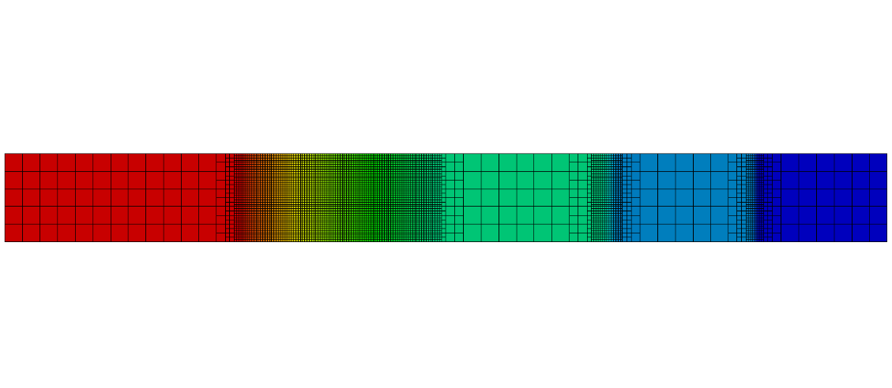

  

The <i>hyStrath</i> GitHub repository is featuring hypersonic and rarefied gas dynamics code developments released under license GPL-3.0. It is the only platform to conjointly host open-source CFD and DSMC codes designed for atmospheric entry analysis.

The platform is meant to be collaborative: if you would like to <a href="https://hystrath.github.io/contributions/">contribute</a>, use it for educational purposes or need support in the form of consulting services, please <a href="https://hystrath.github.io/contact">get in touch</a>. 

 

    

        
    

    

        

            Espinoza et al. (2015) - Sod shock tube simulation with AMR
        

    

    hover-zoom-up

 

    

    

    

    

    

    

    

    

    

    

